<!-- Dynamic Header -->
<p align="center">
  
</p>

<p align="center">
  
</p>

<!-- Typing Animation -->
<p align="center">
  
</p>

<!-- Badges Row -->
<p align="center">
  
  
  <br><br>
  <a href="https://www.linkedin.com/in/sujitrajmehta/"></a>
  <a href="https://github.com/mr-reagen"></a>
  <a href="https://www.facebook.com/mr.srmehta"></a>
  <a href="https://www.instagram.com/sid_reagen/"></a>
</p>

---

<h2 align="center">🏆 GitHub Achievements</h2>
<p align="center">
  
</p>

---

## 👨‍💻 About Me

```bash
┌──────────────────────────────────────────────────────────────┐
│  $ whoami                                                     │
│  > Sujit Raj Mehta — IT Security Manager & Cloud Architect    │
│                                                              │
│  $ cat profile.json                                           │
│  {                                                            │
│    "role"    : "IT Security Manager",                         │
│    "location": "Kathmandu, Nepal 🇳🇵",                        │
│    "focus"   : ["Cloud Security", "DevSecOps", "VAPT"],       │
│    "certs"   : ["DCA", "CCNA", "CompTIA Net+"],               │
│    "fun_fact": "I find bugs before they find me 🐛"           │
│  }                                                            │
└──────────────────────────────────────────────────────────────┘
```

<p align="center">
  
  
  
</p>

---

<!-- Animated Hacker Terminal SVG -->
<h2 align="center">🖥️ Live Terminal</h2>
<p align="center">
  
</p>

---

## 🛡️ Security Arsenal

<p align="center">
  
</p>

<p align="center">
  
  
  
  
  
  
  
  
</p>

<!-- Animated Skill Bars SVG -->
<p align="center">
  
</p>

---

## 💼 Work Experience

<p align="center">
  
  
  
  
  
</p>

## 🚀 Featured Projects

<p align="center">
  
  
</p>

## 🎓 Education & Certifications

<p align="center">
  
  
  <br><br>
  
  
  
  
</p>

---

<h2 align="center">📊 GitHub Analytics</h2>

<p align="center">
  
</p>
<p align="center">
  
  
  
</p>

<h2 align="center">📈 Coding Activity</h2>
<p align="center">
  
</p>

<h2 align="center">📊 GitHub Metrics</h2>

<div align="center">
  
  
</div>

<br>

<div align="center">
  
</div>

---

<!-- Dev Joke -->
<h2 align="center">😂 Dev Joke of the Day</h2>
<p align="center">
  
</p>

<!-- Dev Quote -->
<p align="center">
  
</p>

---

<!-- 3D Contribution Skyline -->
<h2 align="center">🏙️ GitHub Skyline</h2>
<p align="center">
  <a href="https://skyline.github.com/mr-reagen/2025">
    
  </a>
  <a href="https://skyline.github.com/mr-reagen/2024">
    
  </a>
</p>

<!-- Footer -->
<p align="center">
  
</p>
